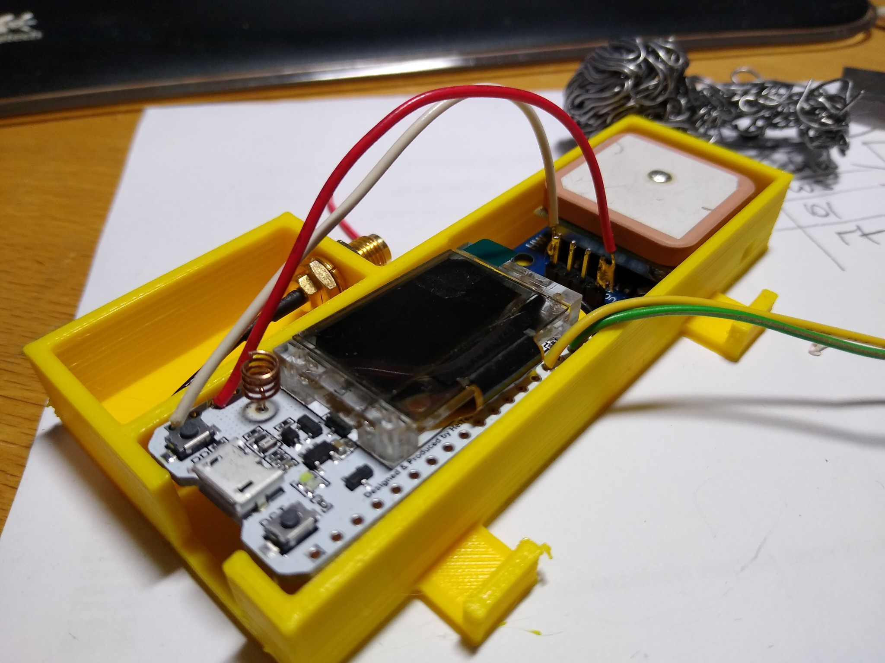
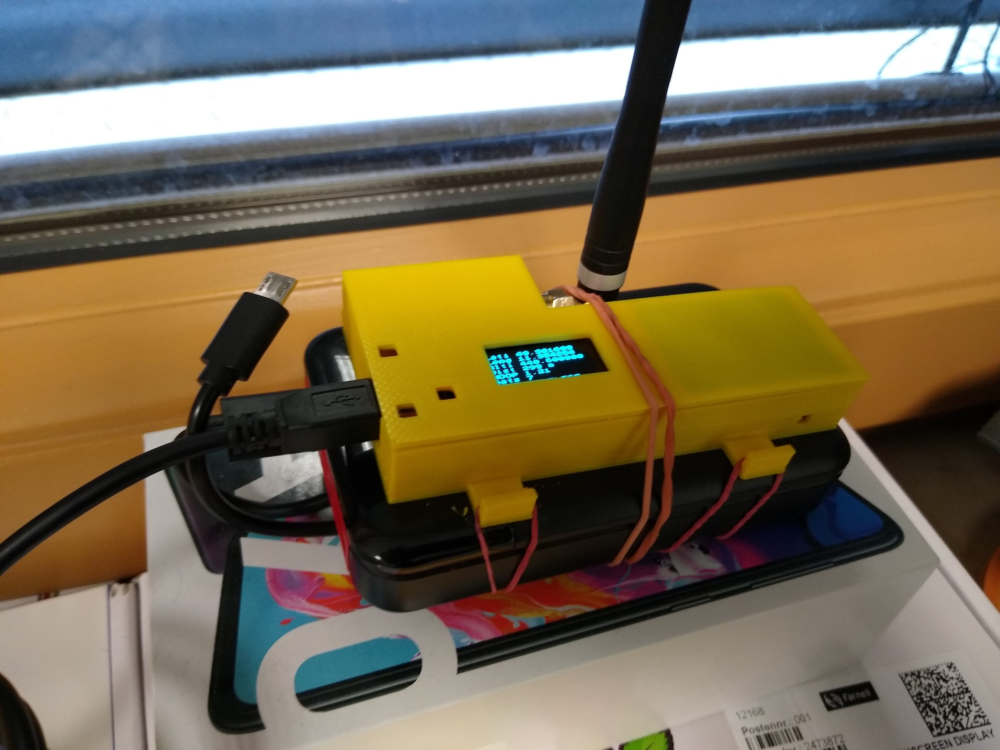

# Lora-TTNMapper-Heltec-v2

## What

Code for a TTNMapper node with GPS running on an [https://heltec.org/project/wifi-lora-32/](Heltec "WiFi Lora32 v2"), based on [Heltec-Wifi-Lora-32-TTN-Mapper by sistemasorp](https://github.com/sistemasorp/Heltec-Wifi-Lora-32-TTN-Mapper)

## Copyright and sources

* Copyright (c) 2015 Thomas Telkamp and Matthijs Kooijman: https://github.com/matthijskooijman/arduino-lmic/blob/master/examples/ttn-abp/ttn-abp.ino
* Copyright (c) 2018 sbiermann: https://github.com/sbiermann/Lora-TTNMapper-ESP32
* Copyright (c) 2019 sistemasorp: https://github.com/sistemasorp/Heltec-Wifi-Lora-32-TTN-Mapper
* Copyright (c) 2020 noppingen: https://github.com/noppingen/Lora-TTNMapper-Heltec-v2/

## Get it running

* Add required libraries
* Set TTN NWKSKEY, APPKSKEY and DEVADDR
* Set GPS_RX and GPS_TX
* Set gateway GPS coordinates to get the distance displayed on your way
* Set TX_INTERVAL, HDOP_MAX and TX_WAIT_INTERVAL
* My case on Thingiverse: https://www.thingiverse.com/thing:4145143

## Images

